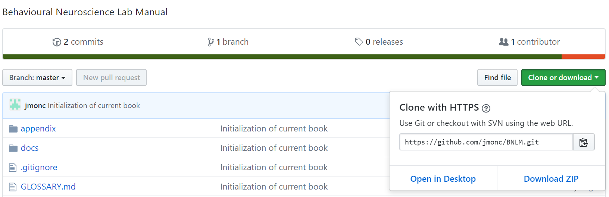

# BNLM documentation
This is the source code document for the Behavioral Neuroscience Lab Manual repository. It is available online  [here](https://behavioural-neuroscience-uofc.gitbook.io/lab-manual) presented using GitBook.

This is a small project which seeks to provide open access resources for Universities in Canada and further afield. Content is hosted on GitHub.

Possible license documentation to be used:
[Creative Commons Attribution-ShareAlike 4.0 license](http://creativecommons.org/licenses/by-sa/4.0/).

# Access to downloads
Currently files have to be downloaded manually by cloning or downloading the file from GitHub.
The simplest way is to simply select "Clone or Download" and then select "Download Zip".

 Upon extracting this file the PDF and word files may be found in the "Offline_documentation" folder.

[hi](https://raw.githubusercontent.com/jmonc/BNLM/master/.gitignore)
